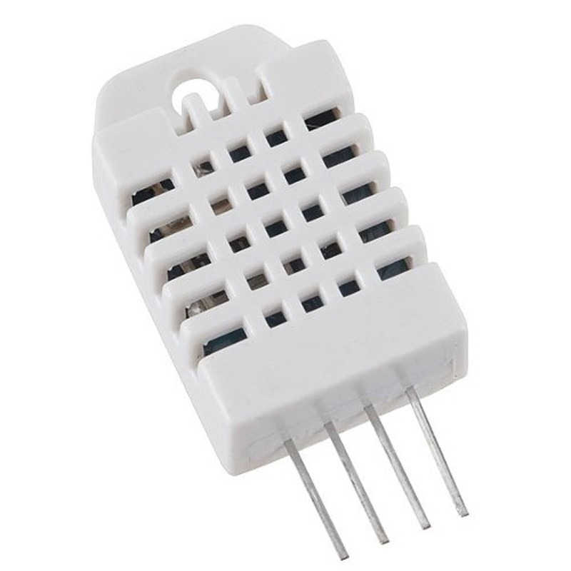
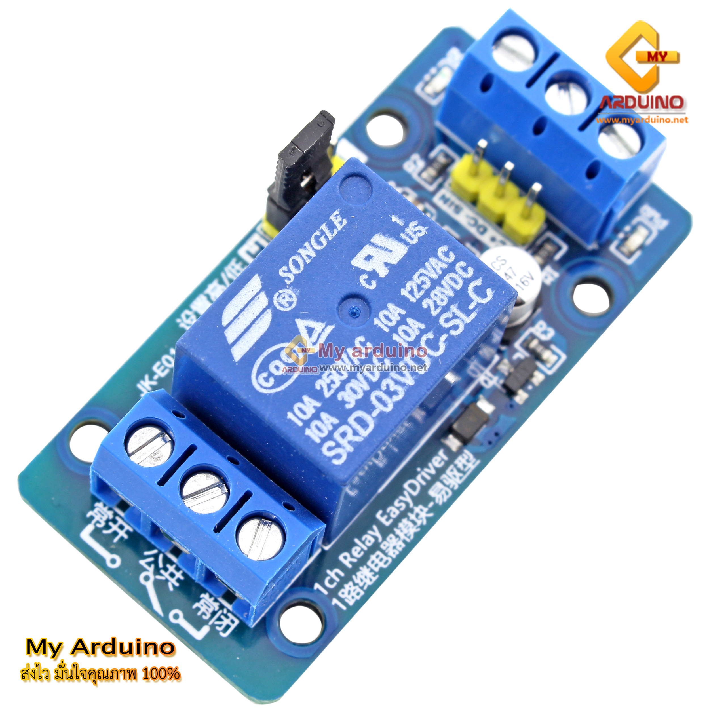
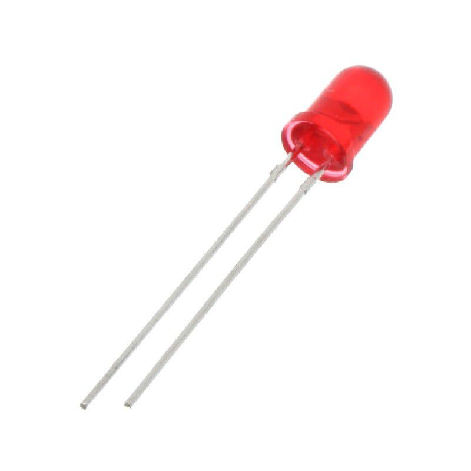
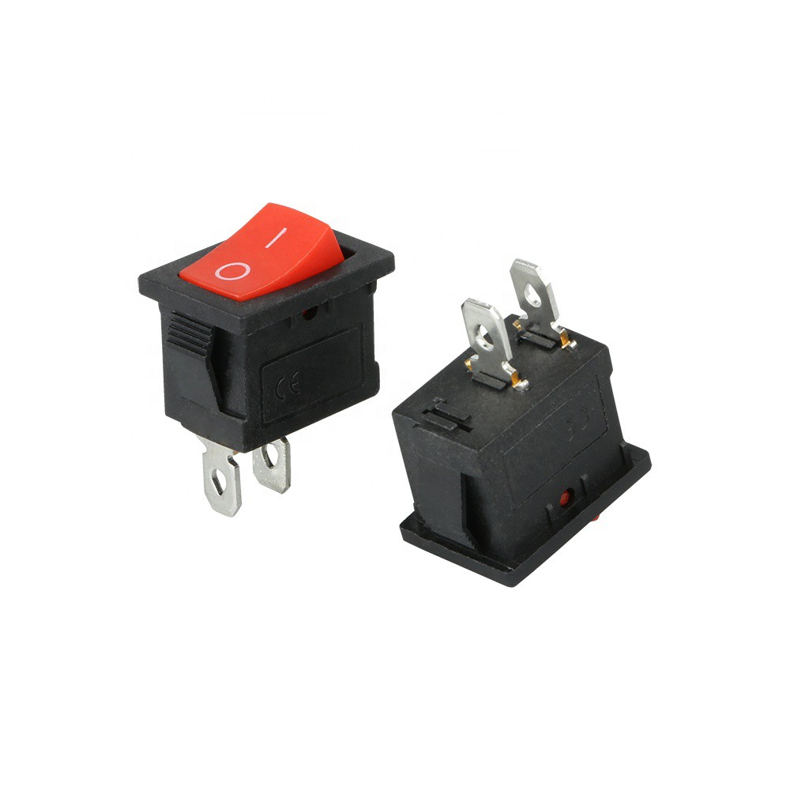
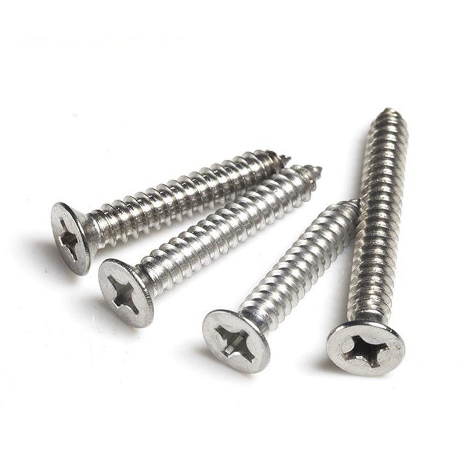

<h1>TempHumidBox</h1>
  
<h1>อุปกรณ์</h1>

Bread Board NodeMCU v.2 (ESP8266)

ขนาด : 46mm. x 35mm.

  

DHT22

ขนาด : 15.5mm. x 12mm.

    

ชุดเปิด/ปิดไฟ (1 Ch. Relay Module)

ขนาด : 4.2 x 2.6 x 1.8cm.

      

หลอดไฟแสดงผล (LED) ขนาด 5mm.

ขนาด : 5mm.

  

ปุ่มกด (Push Switch)

ขนาด : 13.8mm.
         
  

น๊อต M2-M3

ขนาด : M2 1.5mm. และ M3 2.5mm.

  

Detail

ขนาดของฐานล่าง : 116mm. x 90mm.

ขนาดของฝาปิด : 116mm. x 90mm.

ขนาดขอบฝาปิด : 3mm.

ขนาดของรูขั้วต่อไฟ : 13mm. x 16mm.

ขนาดของ Button : 13.8mm.

ขนาด LED: 5.8mm.

ขนาดรูต่อไฟ Relay: 15mm. x 15mm.

รูน็อตเชื่อมกล่อง: 3mm.

